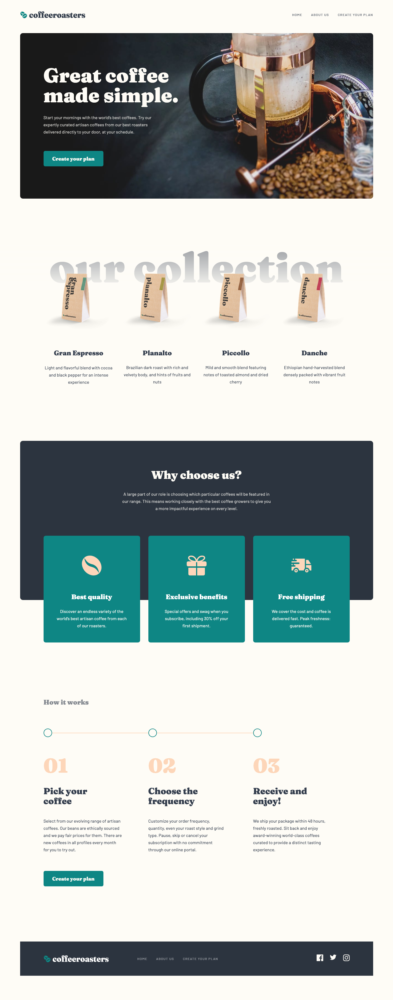

# Coffeeroasters subscription site solution

This is a solution to the [Coffeeroasters subscription site challenge on Frontend Mentor](https://www.frontendmentor.io/challenges/coffeeroasters-subscription-site-5Fc26HVY6). Frontend Mentor challenges help you improve your coding skills by building realistic projects.

## About the Project

The **"Coffeeroasters Subscription Site"** project is a 3-page SPA for customizing coffee subscriptions. Users can explore content on the "Home" and "About Us" pages, or create their plan by answering five questions, with a confirmation modal upon submission. It features a shimmer effect during page loads and is fully responsive.

## Preview and Links

<b>Open Preview</b>

 

 

| [Live Demo URL](https://ionstici.github.io/coffeeroasters-subscription-site) | [Frontend Mentor](https://www.frontendmentor.io/solutions/coffeeroasters-subscription-site-Dp9SHXY4N7) |
| ---------------------------------------------------------------------------- | ------------------------------------------------------------------------------------------------------ |

## Features

- **Three-Page SPA:** "Home", "About Us", and "Create Your Plan" pages for a comprehensive user journey.
- **Shimmer Effect:** Initial page load displays a _shimmer effect_ for a seamless experience while images load.
- **Custom Subscription:** Users can tailor their plan by answering 5 questions on the 'create your plan' page.
- **Confirmation Modal:** Post-submission, a modal confirms the user's plan creation.
  **Responsive Design:** Ensures the site looks and functions well across different devices.

## Tech Stack

- **`Vite`:** For an efficient and fast development environment.
- **`React`:** To build the user interface with reusable components.
- **`react-router-dom`:** For smooth client-side routing between pages.
- **`Scss` Modules:** For component-specific styling, enhancing modularity and maintainability.

## Deployment

This project is hosted on **GitHub Pages**.

## License

This project is licensed under the MIT License. See [LICENSE](./LICENSE) file for more information.
